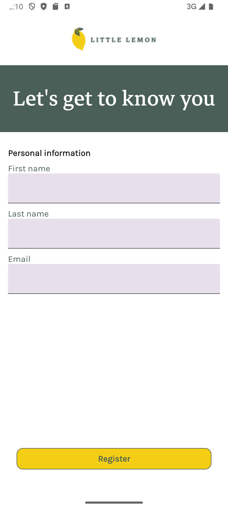
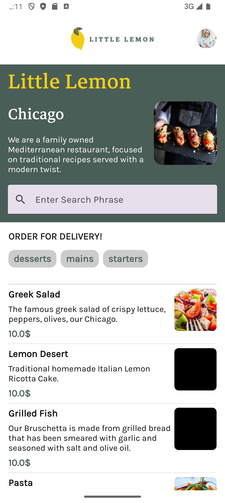
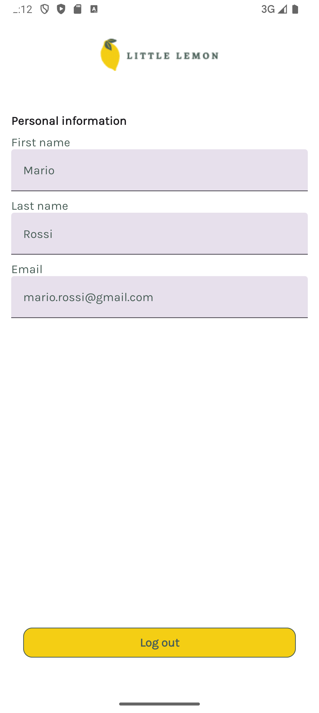
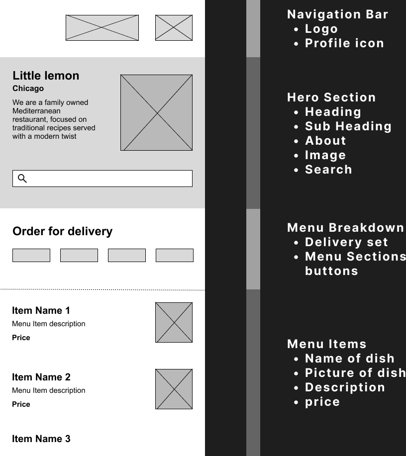

# 🍋 Little Lemon App

Little Lemon is a simple Android application built using Kotlin, following the principles of Clean Architecture and MVVM. The app utilizes Jetpack Compose for UI, Room for local database management, SharedPreferences for simple persistent data storage, Ktor for network requests, Flows and StateFlows for reactive programming, Coroutines for asynchronous programming, and Hilt for dependency injection.

This application was developed as the final project for the "Android App Capstone" module of the Meta Android Developer Professional Certificate on Coursera. However, this version of the app includes features beyond those covered in the certification, incorporating knowledge gained from personal work experience and self-study. If you are interested in a simplified version that strictly follows the certification topics, please check out the `little-lemon` branch.

The Figma Wireframe is available in the `/res/drawable` folder and can also be found in this Markdown file.

## ✨ Features

*   **User Registration and Profile Management:** Users can register and see their profile information.
*   **Menu Management:** Display a menu of dishes, with details such as name, description, price, and image. The user can filter by words and category
*   **Local Data Persistence:** Menu data is stored locally using Room, allowing for offline access.
*   **Remote Data Fetching:** Menu data is fetched from a remote API using Ktor.
*   **User Data Persistence:** User profile information is stored using SharedPreferences.
*   **Clean Architecture:** The app follows the principles of Clean Architecture, with a clear separation of concerns.
*   **MVVM:** The app uses the MVVM pattern to manage data state and lifecycle.
*   **Reactive Programming:** Utilization of Flows and StateFlows for reactive programming.
*   **Asynchronous Programming:** Utilization of Coroutines for asynchronous programming.
*   **Dependency Injection:** Utilization of Hilt for dependency management.

## 📂 Architecture

This project follows Clean Architecture and MVVM principles,  The main modules and their responsibilities are organized as follows::

```
littlelemon/
│── data/           # Data access layer (Repository, API, local Database)
│   ├── local/      # Room database, Dao and Entities
│   ├── network/    # Ktor client, Apis and Dtos
│   ├── repository/ # Repositories implementation
│── domain/         # Use cases, repository interfaces and domain models
│   ├── model/      # Local data classes
│   ├── usecase/    # Use cases 
│   ├── repository/ # Repositories interface
│── presentation/   # UI and navigation with Jetpack Compose and ViewModels
│   ├── components/ # Common Composables
│   ├── navigation/ # Jetpack Navigation Compose and destinations
│   ├── screens/    # Screen composables
│   ├── theme/      # Theme components
│   ├── viewmodel/  # ViewModels
│── di/             # Dependency Injection @Provides with Hilt
│── core/utils/     # Common utility functions
└── ...             # Other project-level files (e.g., MainActivity, LittleLemonApplication)
```

## 🚀 Installation

1. Clone the repository:
   ```sh
   git clone https://github.com/spezio98/little-lemon.git
   ```
2. Open the project in Android Studio.
3. Sync Gradle files.
4. Run the app on an emulator or a physical device.

## 📸 Screenshots
### Onboarding page



### Home page



### Profile page


## 📐 Wireframe


## ▶️ Usage

- Register a new user and log in.
- Browse available menu items. You can filter menu items by words or categories.
- Show user information.
- Perform logout

## 🤝 Contributing

Contributions are welcome! Feel free to submit a pull request.

## 📜 License

This project is licensed under the MIT License - see the [LICENSE](LICENSE) file for details.

👨‍💻 **Developed with ❤️ by Spezio98**

